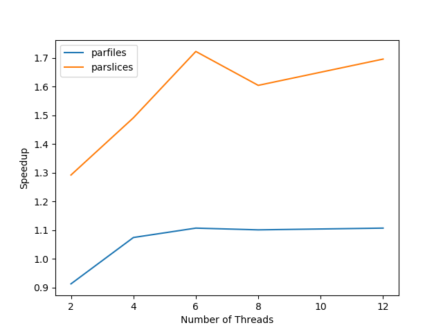

# Project Report

This project reimplemented the [image processing task](https://github.com/mpcs-jh/project-1-yaodan-zhang) but used a work stealing confinement (A work-stealing splits the task into smaller tasks, places them in each thread's work queue such that threads will steal work from other threads when idle.) and the image tasks were modified and updated as well. Download the [data](https://www.dropbox.com/scl/fo/i7o50nu53gbeu2p6cv2ac/h?rlkey=jzr5duh8z7rjq0ccndhn53rnw&dl=0) and place it in the current `proj3/` folder as `data/`. To introduce the new changes, in `scheduler/parfiles.go`, instead of having a global queue for all threads, we create a queue for each thread, and generate tasks from `data/effects.txt` and randomly distribute the task to a queue. After that, each thread will spin on its own queue and steal tasks from other queues if its queue is empty. Similarly, `scheduler/parslices.go` creates a queue for each thread and randomly distributes the tasks to threads' queues, except that the task here is broken into image slice for each single effect instead of the whole image task, and between different effects for the same image task, a barrier using condition variable is implemented to prevent advancing to the next effect before the current effect is done. The image tasks from `data/effects.txt` has been modified from the previous project as well, in which it combines both big and small sizes of an image and mix different task sizes to provide a suitable environment for work stealing.

## Usage

The program can be called by `cd editor/` and then `go run editor.go test s` for running the sequential version (`s` can be neglected, i.e., only call `go run editor.go test` will also call the sequential version). For parallel versions, replace the second command by `go run editor.go test [mode] [number of threads]`, `[mode]` should be `parfiles` or `parslices`, and `[number of threads]` should be a positive integer.

## Speedup graph

For this project, we generate the speedup graph for both running `parfiles` and `parslices` with a fixed set number of threads `T = {2,4,6,8,12}`, and for each `t` number of threads, the speedup is calculated by ${\text{program runtime using 1 thread}} \over {\text{program runtime using t threads}}$. The speedup graph is presented as follows:

## Performance Analysis

The work stealing confinement in this project is suitable in the sense that there are 20 image processing tasks provided in the `data/effects.txt`, each with a varying size. Each thread in our case `T = {2,4,6,8,12}` is expected to get at least 2 tasks initially. The same is for `parslices.go`, where we manually create an expected number of 2 tasks for each thread. The barrier acts according to a map-reduce framework, as it waits for all slices in the current effect to be completed before proceding to the next effect of the same image.

There are challenges when implementing this system as well. First of all, the main goroutine distributing a task while other goroutines dequeueing the tasks may create data races. We therefore need to make each queue manipulation thread-safe by adding a TAS lock to each queue. Secondly, a goroutine stealing a task from another queue while that queue is being dequeued by its own goroutine can also create data races, and therefore is also safeguarded by the queue's TAS lock. These two situations can generate a high overhead regarding goroutine communications, which might be a possibility for why the program runtime is 3x project 1.

About the work stealing confinement, whether it improves the performance depends on the tradeoff between the threads' communication overhead specified in the former section and the actual advantage of work stealing/parallelization. It also depends on the number of threads in how severe this overhead can be and different task scenarios in real-world programs. Apart from those, this is more or less a random issue where each execution can differ because task distribution is random in nature and thread's target victim for stealing is also randomly picked, so it doesn't guarantee that the victim queue must have a task to be stolen.

Back to the speedup graph, we can see that different from project 1 in which parfiles provides a superior speedup than parslices, this project seemed to revert the case. Parslices provides ~1.5 speedup in average while parfiles doesn't seem to have an obvious one. There are three different factors driving the speedup, the number of threads/level of parallelization (positive), goroutines communication/synchronization overhead (negative), and the work stealing effectiveness (positive). Both implementations had a speedup positively correlated to the number of threads, but parfiles seemed to reach the limit of 1.1x in our case.

Future improvements can use a lock-free implementation for the queue, e.g., compare-and-swap (CAS), to guarantee that each thread is making progress regarless of the lock status. There can also be a properly chosen number of threads for each specific real-world task because of the three driving factors for performance we discussed in the formal section, whereas in our case parslices with 6 threads seems to be the best one among all.

## How to Reproduce the Speedup Graph

To reproduce the speedup graph, go to `cd benchmark/` and run `python Plot.py`, or clone the whole project repository to the UChicago Peanut Cluster, cd to the `benchmark/` directory, and run `sbatch Plot.sh`. Depending on the network and server availability, the whole process took 15 minutes in my local machine, but 46 minutes when I ran it on the Peanut Cluster.
